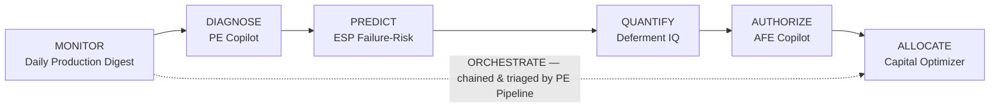

# Upstream Copilot Suite
### AI-native production engineering — an asset team's toolkit, rebuilt as live apps

    

> Nine years a **production engineer** at Occidental & Shell (Permian Delaware/Midland + Gulf of Mexico) — surveillance, artificial lift, well integrity, AFEs, base management. Now I build the AI tooling I wish I'd had: **seven live, public apps, each owning one stage of how an asset team actually runs** — from the 6 a.m. production digest to the annual capital plan, wired together over one shared Permian fleet. Every link below opens with **no login** and runs in your browser.

**One architecture across all seven:** deterministic petroleum-engineering math for the numbers + an LLM for reasoning & narration · **eval-gated in CI** · bring-your-own-key (every deterministic feature works with no key) · a **shared fleet registry** so the same well reads coherently end-to-end · one unified dark/navy theme + a cross-app suite navigator · **auto-deploys on every push to `main`**. Not slideware — open any link and use it.

---

## The production decision loop

*Each module owns a distinct decision the others don't — remove one and there's a gap. The **PE Pipeline** is the front door: it ranks the whole fleet by risked-NPV opportunity, then drills any well through detect → predict → authorize over versioned JSON contracts (proof these were designed to interoperate, not bolted together).*

---

## The seven apps

| Stage | App | What it does | Live | Repo | Ver |
|---|---|---|:--:|:--:|:--:|
| **Monitor** | **Daily Production Digest** | Fleet production explorer + daily anomaly brief: time-range oil/gas/water trends (7D → lifetime), a sortable fleet table, and per-well drill-down. Robust-stats anomaly scan ranked by deferred $/day; LLM writes the Senior-PE morning brief. | [open ▶](https://daily-pe-digest.streamlit.app) | [code](https://github.com/diazaeric1-droid/daily-production-digest) | `0.5.0` |
| **Diagnose** | **Production Engineer Copilot** | AI well review: an LLM agent runs decline / type-curve / ESP / economics analyzers via tool-use and writes a VP-ready well review. Fleet table + per-well pages, an inline **Generate-AFE** handoff, and Monte-Carlo economics. **1.00 agreement on a blind holdout**, CI-gated ≥0.85. | [open ▶](https://pe-copilot.streamlit.app) | [code](https://github.com/diazaeric1-droid/production-engineer-copilot) | `0.7.0` |
| **Predict** | **ESP Failure-Risk** | 30-day ESP-failure classifier (XGBoost) with **Tree SHAP** drivers reconciled to the calibrated probability, plus **survival / RUL** curves and a fleet RUL ranking. Fleet table + per-well pages. | [open ▶](https://esp-failure-risk.streamlit.app) | [code](https://github.com/diazaeric1-droid/esp-failure-risk-agent) | `0.7.0` |
| **Quantify** | **Deferment IQ** | Lost-oil accounting vs. each well's potential → deferment waterfall, **$-Pareto by cause**, and a prioritized recovery work-queue (ranked by recoverable $ ÷ MTTR). Reason-code NLP classifier, CI-gated. Fleet table + per-well pages. | [open ▶](https://deferment-iq.streamlit.app) | [code](https://github.com/diazaeric1-droid/deferment-iq) | `0.3.0` |
| **Authorize** | **AFE Copilot** | Drafts AAPL-1213-style AFEs with tangible/intangible + WI/NRI economics, a **cost waterfall**, authority-limit routing, and an immutable audit trail. Pipeline overview + per-AFE pages; one-click **.docx export**. | [open ▶](https://afe-copilot.streamlit.app) | [code](https://github.com/diazaeric1-droid/afe-copilot) | `0.6.0` |
| **Allocate** | **Capital Optimizer** | Risked single-project economics (Arps → DCF → risked NPV) + **MILP** program selection under budget & rig-day constraints — single- and multi-period, with an efficient frontier. ~12% more risked NPV than rank-and-cut. | [open ▶](https://capital-optimizer.streamlit.app) | [code](https://github.com/diazaeric1-droid/capital-optimizer) | `0.2.0` |
| **Orchestrate** | **PE Pipeline** | A **fleet triage board** that ranks the whole fleet by risked-NPV opportunity (deferred $ × failure risk × intervention economics), then drills any well through **detect → predict → authorize** end-to-end over versioned `WellAlert` / `WellDiagnosis` contracts. | [open ▶](https://pe-pipeline.streamlit.app) | [code](https://github.com/diazaeric1-droid/pe-pipeline) | — |

All seven are live on **Streamlit Community Cloud**, public (no sign-in), and auto-deploy from GitHub `main`. Apps sleep when idle and wake on first visit (~30s).

---

## The shared architecture

- **Deterministic math, LLM narration.** The petroleum-engineering numbers — decline fits, type curves, ESP diagnostics, calibrated failure probabilities, deferment accounting, AFE economics, the MILP — are deterministic, unit-tested code. The LLM is confined to reasoning over those results and writing them up. The numbers stay trusted and testable; the language is where the model adds value.
- **Eval-gated CI.** GitHub Actions fail the build on regression: a **≥0.85 recommendation-agreement** gate (PE Copilot, against a de-leaked dev + blind-holdout set), an **80% reason-code-classifier** gate (Deferment IQ), an **optimizer-beats-greedy + feasibility** gate (Capital Optimizer), and a backtest gate (Digest). Numbers, not vibes.
- **BYOK.** Each app has a sidebar field for the visitor's own Anthropic key (never stored). Every deterministic feature — the math, the charts, the AFE docx, the triage board — works with **no key at all**.
- **Shared fleet registry.** A single source of truth for well identity/metadata (Permian Midland + Delaware), vendored byte-identical into every app and joined on `well_id`. It's purely additive enrichment — it never touches any app's eval/label/holdout data, so the gates stay honest. The same well reads the same everywhere from Monitor through Authorize.
- **Unified product identity.** One dark/navy "Upstream Copilot Suite" theme and a cross-app sidebar suite navigator across all seven, so they read as one product family, not seven demos.
- **Auto-deploy.** Every push to `main` redeploys the live app — no manual step.

---

## How it's engineered

- **Versioned like a product.** Every repo is **SemVer** with a `CHANGELOG.md` (Keep-a-Changelog) and an in-app "What's new" badge; the latest wave is the **June 2026** suite overhaul (fleet explorers across the production apps, the fleet triage board, survival/RUL modeling, multi-period MILP, and the shared registry).
- **Two CI tiers per repo.** An **eval-regression gate** (above) on the apps that have one, plus a **render-smoke** job that boots the app under **Python 3.14** via Streamlit's `AppTest` harness and fails if it raises — the gate that catches deploy-only breakage unit tests can't see (see the case study below).
- **Honest by design.** Where honest evaluation needs labels (ESP failures, reason codes) the data is **synthetic with known ground truth**, deliberately noisy/overlapping so the metrics are real rather than perfect; real public production data (Texas RRC / NM OCD) is the in-progress milestone, landing behind the same registry interface so the apps don't change. Reported metrics use the same procedure as the shipped artifact (e.g. out-of-fold for the ESP model), and the blind-holdout framing is stated up front.
- **Case studies** — three short writeups of the engineering, in [`case-studies/`](https://github.com/diazaeric1-droid): a real correctness bug an honest eval surfaced, turning seven apps into one fleet decision tool, and diagnosing deploy-only failures on the Python 3.14 stack.

---

## About

**Eric A. Diaz II** — Houston, TX · BS Mechanical Engineering (Minor: Mathematics), Texas Tech · 9 yrs upstream production engineering (Occidental, Shell — Permian + Gulf of Mexico), now AI engineer.
[LinkedIn](https://www.linkedin.com/in/eric-a-diaz2) · diaz.a.eric1@gmail.com · [github.com/diazaeric1-droid](https://github.com/diazaeric1-droid) — **open to senior Production / Data / AI-engineering roles in energy.**
