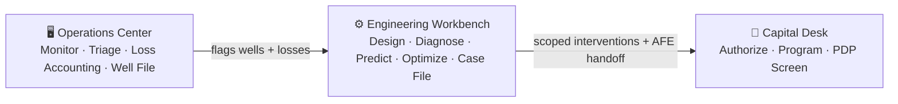

# Upstream Copilot Suite
### AI-native production engineering — three professional operator consoles, built by a 9-year PE

    

> Nine years a **production engineer** at Occidental & Shell (Permian Delaware/Midland + Gulf of Mexico) — surveillance, artificial lift, well integrity, AFEs, base management. Now I build the AI tooling I wish I'd had. The suite covers the full upstream decision loop — from the 6 a.m. fleet brief to the annual capital authorization — consolidated into **three consoles that look and behave like the tools big operators pay seven figures for**, and open in your browser with no login.

---

## The three operator products

*Pick a well and a price deck once. Every page in every product follows.*

---

### Operations Center

**Daily fleet surveillance and loss accounting for an asset team.**

The front door for your shift: a live triage board ranks every well by risked-NPV opportunity, the morning brief is AI-written from the anomaly scan, and ongoing events (workovers, downtime, ESP failures) are tracked in one place. Switch to Loss Accounting for the deferment waterfall, a $-Pareto by cause, and a prioritized recovery work queue. Well File gives you a per-well action chain and full operating history — every lens the fleet has on that well, in one page.

- **Surveillance:** Triage Board · Morning Brief · Ongoing Events
- **Loss Accounting:** Deferment Waterfall · Cause Pareto · Recovery Work Queue
- **Well File:** Well 360 · Action Chain
- **Under the hood:** Daily Digest (v0.6.3) · Deferment IQ (v0.5.1) · ESP scoring · AFE economics · PE Pipeline triage math — 31 tests, CI green
- **[open ▶](https://operations-center.streamlit.app)** · [code](https://github.com/diazaeric1-droid/operations-center)

---

### Engineering Workbench

**Per-well engineering from first principles to intervention recommendation.**

The diagnostics console: start with a nodal analysis (Vogel IPR × Hagedorn-Brown/Beggs-Brill VLP), run a decline fit and EUR, check the 30-day ESP failure probability with SHAP driver decomposition, then jump to gas-lift injection optimization or injection fleet allocation. The **Well Case File** assembles every available engineering lens on one well and exports a downloadable one-pager — unavailable lenses are greyed out honestly rather than filled with fake numbers.

- **Design:** Nodal Analysis · PVT & Type Curves · Lift Design
- **Diagnose:** Decline & EUR · AI Well Review (VP-ready, CI-gated ≥0.85)
- **Predict:** ESP Failure Risk (XGBoost + Tree SHAP) · Run-Life (survival curves)
- **Optimize:** Gas-Lift Optimum · Injection Fleet Allocation (equal-marginal-revenue)
- **Case File:** Well Case File (all-lenses one-pager, markdown export)
- **Under the hood:** Well Performance Studio (v0.2.2) · PE Copilot (v0.9.2) · ESP Risk (v0.7.3) · Gas-Lift Advisor (v0.1.0) — 54 tests, CI green
- **[open ▶](https://engineering-workbench.streamlit.app)** · [code](https://github.com/diazaeric1-droid/engineering-workbench)

---

### Capital Desk

**AFE authorization, program optimization, and deal screening.**

Drafts AAPL-1213-style AFEs with tangible/intangible breakdown, WI/NRI economics, authority-limit routing, and an immutable audit trail (one-click `.docx` export). The Program module runs a MILP over your project backlog under budget and rig-day constraints — ~12% more risked NPV than rank-and-cut — with an efficient frontier and multi-period sensitivity. The **PDP Screener** fits Arps decline curves to a real-acquisition dataset (28-well Colorado package, $44.5MM PV10 at the default deck) and returns a PV10 verdict against your asking price.

- **Authorize:** AFE Pipeline Board · Draft AFE · Cost Variance
- **Program:** Project Backlog · MILP Optimizer · Frontier & Sensitivity
- **Screen:** PDP Screener (Arps fit · forecast from last history · PV10 via econ\_core)
- **Under the hood:** AFE Copilot (v0.6.2) · Capital Optimizer (v0.2.3) · new PDP engine — 28 tests, CI green
- **[open ▶](https://capital-desk.streamlit.app)** · [code](https://github.com/diazaeric1-droid/capital-desk)

---

## Under the hood: 9 certified engineering components

The products are built by vendoring these repos byte-identical under a shared alias loader — no forks, no divergence. Every component is independently versioned, CI-gated, and live as a standalone app.

| Component | What it does | Live | Repo |
|---|---|:--:|:--:|
| **Daily Production Digest** | Fleet explorer + LLM morning brief; robust-stats anomaly scan | [open ▶](https://daily-pe-digest.streamlit.app) | [code](https://github.com/diazaeric1-droid/daily-production-digest) |
| **Production Engineer Copilot** | LLM well review via tool-use; CI-gated ≥0.85 agreement | [open ▶](https://pe-copilot.streamlit.app) | [code](https://github.com/diazaeric1-droid/production-engineer-copilot) |
| **ESP Failure-Risk** | XGBoost 30-day classifier + Tree SHAP + survival/RUL | [open ▶](https://esp-failure-risk.streamlit.app) | [code](https://github.com/diazaeric1-droid/esp-failure-risk-agent) |
| **Deferment IQ** | Lost-oil accounting → waterfall, $-Pareto, recovery queue | [open ▶](https://deferment-iq.streamlit.app) | [code](https://github.com/diazaeric1-droid/deferment-iq) |
| **AFE Copilot** | AAPL-1213 AFE drafting, authority routing, audit trail, .docx | [open ▶](https://afe-copilot.streamlit.app) | [code](https://github.com/diazaeric1-droid/afe-copilot) |
| **Capital Optimizer** | Arps → DCF → risked NPV + MILP program selection | [open ▶](https://capital-optimizer.streamlit.app) | [code](https://github.com/diazaeric1-droid/capital-optimizer) |
| **Well Performance Studio** | PVT, Vogel IPR × HB/BB nodal, ESP/gas-lift design, RTA | [open ▶](https://well-performance-studio.streamlit.app) | [code](https://github.com/diazaeric1-droid/well-performance-studio) |
| **PE Pipeline** | Multi-agent fleet triage: detect → predict → authorize, versioned JSON contracts | [open ▶](https://pe-pipeline.streamlit.app) | [code](https://github.com/diazaeric1-droid/pe-pipeline) |
| **Gas-Lift Advisor** | GLPC fit + analytical injection optimum + shadow-price fleet allocation | [via Workbench ▶](https://engineering-workbench.streamlit.app) | [code](https://github.com/diazaeric1-droid/well-gas-lift-advisor) |

All component apps are live on Streamlit Community Cloud, public (no login), auto-deploy from `main`. Apps sleep when idle and wake on first visit (~30s).

---

## Architecture

**Deterministic math, LLM narration.** The petroleum-engineering numbers — decline fits, nodal solutions, calibrated failure probabilities, deferment accounting, AFE economics, the MILP, injection optima — are deterministic, unit-tested code. The LLM reasons over those results and narrates them. Numbers stay trusted and testable; the model adds judgment, not arithmetic.

**Eval-gated CI.** GitHub Actions fail the build on regression: ≥0.85 recommendation-agreement (PE Copilot, blind holdout), 80% reason-code classifier (Deferment IQ), optimizer-beats-greedy + feasibility (Capital Optimizer), GLPC R² ≥ 0.90 + economic capture ≥ 0.95 (Gas-Lift), backtest gate (Digest). Every metric uses the same procedure as the shipped artifact — no inflation.

**Byte-identical vendoring.** Component source is copied, not forked, into product repos. Verified identical by diff at build time; only 2 files in the entire suite needed a 1-line import rewrite (documented in each product's `VENDORING.md`). The products can't silently drift from the components they're built on.

**BYOK.** A sidebar field accepts your Anthropic key (never stored or logged). Every deterministic feature — charts, tables, AFE docx, triage board, MILP solver, injection optimizer — works with no key at all. The key unlocks the LLM narration layer only.

**Shared fleet registry.** One well-identity/metadata source (Permian Midland + Delaware), vendored into every component and product, joined on `well_id`. The same well reads consistently from the morning brief through the capital authorization — additive enrichment only, never touching eval data.

---

## About

**Eric A. Diaz II** — Houston, TX · BS Mechanical Engineering (Minor: Mathematics), Texas Tech · 9 yrs upstream production engineering (Occidental, Shell — Permian + Gulf of Mexico) · AI engineer.

[LinkedIn](https://www.linkedin.com/in/eric-a-diaz2) · diaz.a.eric1@gmail.com · [github.com/diazaeric1-droid](https://github.com/diazaeric1-droid) — **open to senior Production / Data / AI-engineering roles in energy.**
