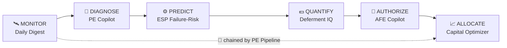

# Upstream Copilot Suite
### AI-native production engineering — an asset team's toolkit, rebuilt as live apps

   

> 9 years a **production engineer** at Occidental & Shell (Permian Delaware/Midland + Gulf of Mexico) — surveillance, artificial lift, well integrity, AFEs, base management. Now I build the AI tooling I wish I'd had: **seven live apps, each owning one stage of how an asset team actually runs** — from the 6 a.m. surveillance brief to the annual capital plan.

**One architecture across all seven:** deterministic petroleum-engineering math + an LLM for reasoning & narration · **eval-gated in CI** · bring-your-own-key · live, versioned, and continuously iterated. Not slideware — open any link, no login, and use it.

---

## The production decision loop

*Each module owns a distinct decision the others don't — remove one and there's a gap. The **PE Pipeline** wires them together via versioned JSON contracts (proof they were designed to interoperate, not bolted on).*

---

## The modules

| Stage | App | What it does — and why it's necessary | Live | Code | Ver |
|---|---|---|:--:|:--:|:--:|
| 🛰️ **Monitor** | **Daily Production Digest** | Robust-stats anomaly scan → Senior-PE morning brief **ranked by deferred $/day**. You can't eyeball 200+ wells by hand. | [▶](https://diazaeric1-daily-pe-digest.hf.space) | [repo](https://github.com/diazaeric1-droid/daily-production-digest) | `0.3.0` |
| 🧠 **Diagnose** | **Production Engineer Copilot** | LLM agent runs decline/ESP/economics analyzers via tool-use → **VP-ready well review**. Surveillance finds *what*; this explains *why + what to do*. **1.00 blind-holdout eval**, runs on real Volve data. | [▶](https://diazaeric1-pe-copilot.hf.space) | [repo](https://github.com/diazaeric1-droid/production-engineer-copilot) | `0.5.0` |
| ⚙️ **Predict** | **ESP Failure-Risk** | Calibrated **30-day ESP-failure classifier** (XGBoost + Tree SHAP), precision@k alert list. Get ahead of the $250–500k reactive failure. | [▶](https://diazaeric1-esp-failure-risk.hf.space) | [repo](https://github.com/diazaeric1-droid/esp-failure-risk-agent) | `0.5.0` |
| 💵 **Quantify** | **Deferment IQ** | Lost-oil accounting vs. well potential + **reason-code NLP classification (~92%)** → $-Pareto and **recoverable opportunity**. The weekly base-management number. | [▶](https://diazaeric1-deferment-iq.hf.space) | [repo](https://github.com/diazaeric1-droid/deferment-iq) | `0.1.0` |
| 📝 **Authorize** | **AFE Copilot** | Drafts AAPL-1213 AFEs with **tangible/intangible + WI/NRI economics**, authority routing, and actual-vs-AFE variance. Nothing happens without a funded, routed authorization. | [▶](https://diazaeric1-afe-copilot.hf.space) | [repo](https://github.com/diazaeric1-droid/afe-copilot) | `0.4.0` |
| 📈 **Allocate** | **Capital Program Optimizer** | Risked project economics + **MILP** program selection under budget & rig constraints — **~12% more risked NPV than rank-and-cut**. The annual plan: where the capital goes. | [▶](https://diazaeric1-capital-optimizer.hf.space) | [repo](https://github.com/diazaeric1-droid/capital-optimizer) | `0.1.0` |
| 🔗 **Orchestrate** | **PE Pipeline** | Chains **detect → predict → authorize** on a single well end-to-end via versioned `WellAlert`/`WellDiagnosis` JSON contracts. | on-demand¹ | [repo](https://github.com/diazaeric1-droid/pe-pipeline) | — |

¹ PE Pipeline runs on demand — the Hugging Face free tier caps at 6 concurrently-running Spaces; all code is on GitHub and it deploys in a click.

---

## Built like production software, not slideware

- **Versioned** — every repo is semver with a `CHANGELOG.md` and an in-app "What's new" badge; latest release wave **June 2026** (an audit-driven correctness + PE-value pass).
- **Eval-gated CI** — GitHub Actions fail the build on regression: a 0.85 recommendation-agreement gate (Copilot), an 80% reason-code-classifier gate (Deferment IQ), an optimizer-beats-greedy + feasibility gate (Capital Optimizer), a backtest gate (Digest). Numbers, not vibes.
- **Honest by design** — deterministic engineering math stays trusted and testable; the LLM is confined to reasoning and narration; synthetic data is deliberately noisy/overlapping so metrics are real, not perfect.
- **Roadmaps** in each repo — these are actively built, not frozen.

---

## About

**Eric A. Diaz II** — Houston, TX · BS Mechanical Engineering (Texas Tech) · 9 yrs upstream production engineering (Occidental, Shell)
[LinkedIn](https://www.linkedin.com/in/eric-a-diaz2) · diaz.a.eric1@gmail.com — **open to senior Production / Data / AI-engineering roles in energy.**
